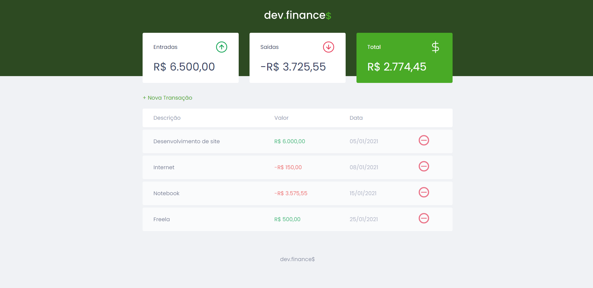
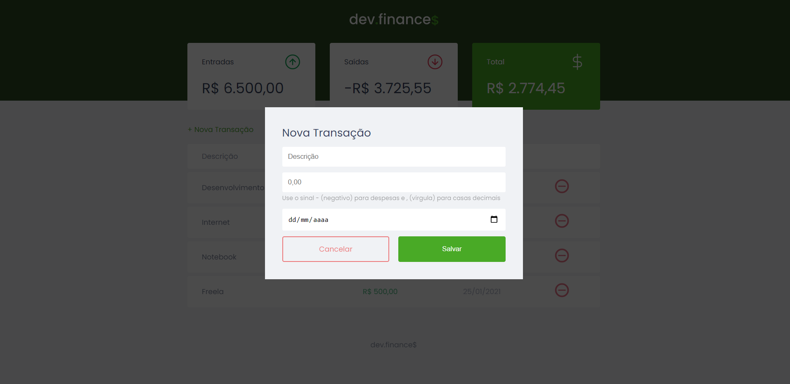

## Sobre o projeto
Este projeto foi desenvolvido durante a **[Maratona Discover #01](https://maratonadiscover.rocketseat.com.br/inscricao)**.

O dev.finances é uma aplicação de controle financeiro, onde é possível cadastrar e excluir transações e ver o saldo de entrada e saída.

## Layout
No link abaixo você encontra o layout do projeto web.
* [Layout dev.finance$](https://www.figma.com/file/7Vu9DzUaCZIV4nibzkjgB4/dev.finance%24-Maratona-Discover)

## Tecnologias usadas na construção do projeto

* HTML
* CSS
* JavaScript

<h4 align=center target="_blank" >Por Lucas Godoi <a href="https://www.linkedin.com/in/godoi-lucas/">Entre em contato :)</a></a></h4>
